# FY2022 Project PLATEAU UC22-034「河川整備効果の見える化」の成果物
### reearth-plugin-floodrisk-widget
### 河川整備効果の見える化支援ツール　Re:Earth用プラグイン

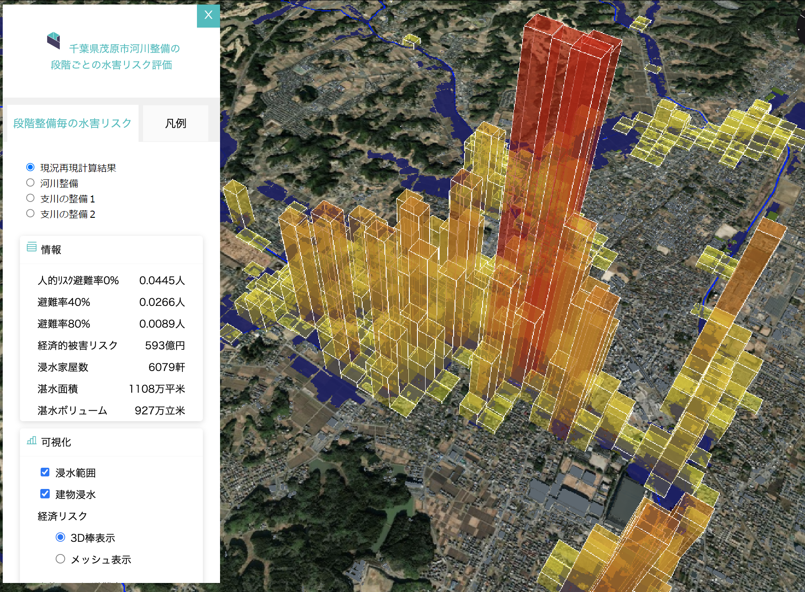

## 1. 概要
本プラグインを活用すると、オープンソースwebGISソフトウェアRe:Earthにおいて、河川の浸水対策に応じて浸水範囲等が段階的に縮小していく様子や、それに伴い人的リスクや経済リスクが変化していく様子をWebGIS上で示すことができます。
各種データ仕様については、[サンプルデータ](/Data_required_for_build)を参照してください。 

## 2. 「河川整備効果の見える化」について
令和4年度の3D都市モデルを活用した社会的課題解決型ユースケース開発業務「河川整備効果の見える化」において、昨今に多大な水害被害を発生させた令和元年10月25日降雨（L1計画規模よりやや大きい）によって生じる洪水を三次元データとして3D都市モデルに重ね合わせ、その被害規模を可視化するとともに、河川氾濫によって生じる被害リスクを指標化し、3D棒グラフやメッシュ表現によって地図上に表示できるようにしました。  
ウェブ上で利用可能なオープンソースGISであるRe:Earthを活用し、浸水対策段階毎の浸水の広がりや水害リスク、個々建物の浸水リスクをユーザーが任意に切り替えて三次元的に表示ができる機能を付加するプラグイン開発を行いました。  
さらに、ウェブ上で利用可能なオープンソースGISであるRe:Earthを活用し、河川整備段等の浸水対策の段階毎の浸水の広がりや水害リスク、個々建物の浸水リスクの変化をユーザーが任意に切り替えて表示ができる機能を付加するプラグイン開発しました。
詳細は[技術検証レポート](https://www.mlit.go.jp/plateau/file/libraries/doc/plateau_tech_doc_0011_ver01.pdf)を参照してください。

## 3. 利用手順

### 3.1. 環境の準備

プラグインを利用するために、以下を設定します。
- Re:Earthのプロジェクトの作成
- プラグインのインストール

#### アカウント作成
（1）[https://reearth.io/](https://reearth.io/)にアクセスしページ右上の「Start now」をクリックします。

(2) 「Sign Up」からメールアドレス、ユーザー名、パスワードを入力して、「SIGN UP」をクリックすることで、アカウントを作成することができます。
既にアカウントを持っている場合は「Log In」からユーザー名とパスワードを入力してRe:Earthにログインしてください。

(3) Re:Earthにログインするとダッシュボード画面が表示されます。

#### Re:Earthのプロジェクトの作成
 「新規プロジェクト作成」ボタンをクリックします。

「プロジェクト名」を入力し、「作成」ボタンをクリックします。

プロジェクトのボードが作成されるので、編集するプロジェクトボードにマウスカーソルをあてます。
     ボタンが３つ表示されるので、一番左の「編集ボタン」をクリックします。

マップの編集ページが表示されます。編集ページは主に４つの領域で構成されています。
   - ツールバー：レイヤーを追加する際に使用する。
   - マップ表示領域：地図が表示されます。
   - アウトライン：マップに追加しているレイヤーやプラグインによるウィジェットを管理します。
   - 設定項目：レイヤーやプラグインの各種設定を行います。

千葉県茂原市付近を標準で表示させるように設定します。
地図を操作して、千葉県茂原市のあたり（図中の緑丸付近）を表示します。
左パネルの「シーン」をクリックし、カメラ初期位置の「未設定」をクリックします。その後、「キャプチャ」ボタンをクリックしてください。

#### インストール

1. Re:Earthのプロジェクト編集ページを開き、ページ上部のプロジェクト名をクリックし、「プラグイン」をクリックしてプラグインページを開きます。
   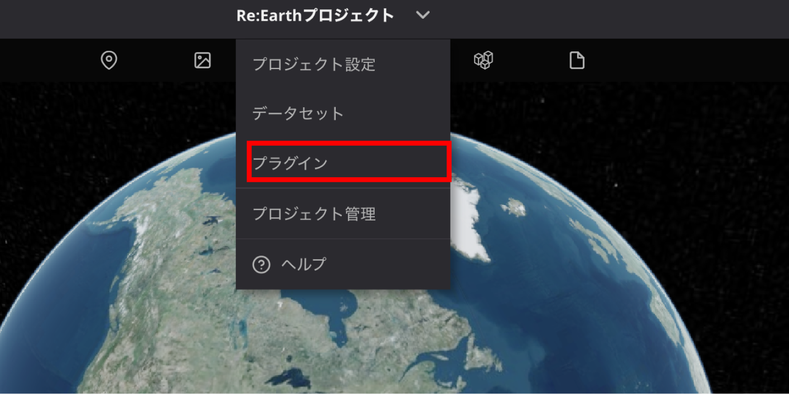

2. プラグインページから「個人インストール済み」タブを開きます。
   
3. プラグインをzipファイルからインストールします。「PCからZipファイルをアップロード」を選択し、[ダウンロード](https://github.com/Project-PLATEAU/UC22-034-reearth-plugin-floodrisk-widget/releases/tag/v1.0)したzipファイルを選択します。
4. 編集画面に戻り、ページ左側に表示されているアウトラインの「ウィジェット」の＋ボタンをクリックし、「河川整備効果の見える化ウィジェット」を追加します。
   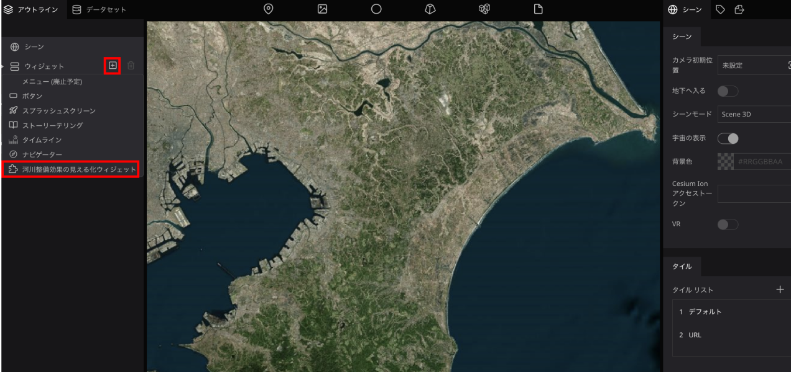

### 3.2. 設定方法

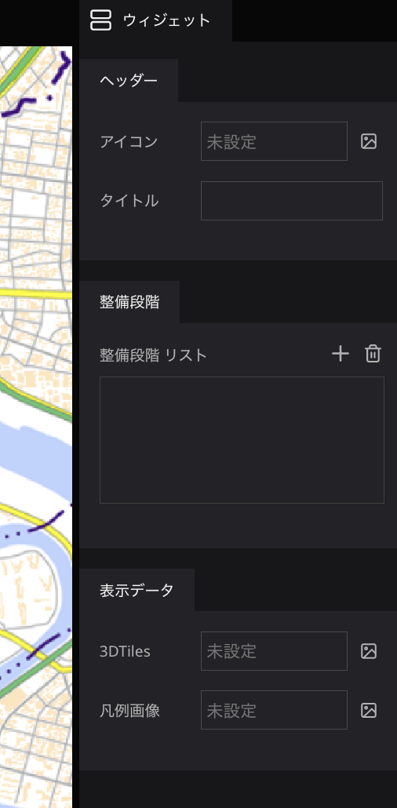
- ヘッダー
  - アイコン：ウィジェットのヘッダーに表示するアイコンを指定することができます。
  - タイトル：ウィジェットのヘッダーのタイトルを変更することができます。未入力の場合は「河川整備の段階ごとの水害リスク評価」となります。

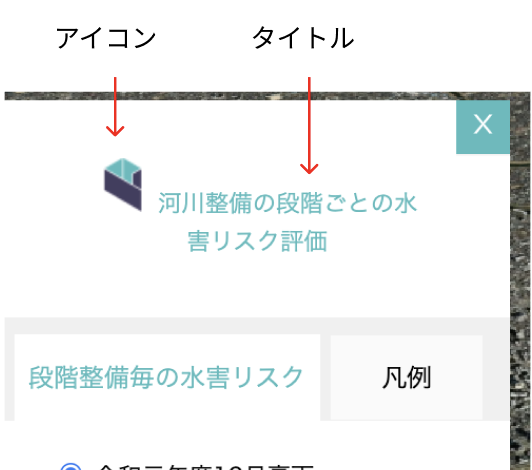

- 河川整備段階：＋ボタンをクリックすることで整備段階のリストを追加することができます。
  4回クリックし、４段階分リストを追加してください。
  河川整備段階リストの1では、現況再現計算結果、2は河川整備、3は支川の整備１、4は支川の整備２を選択した際に表示するデータを設定します。
  各整備段階では以下の項目を設定します

  
  - 浸水czml：浸水のczmlを指定します。 
   （参照フォルダ：[/Data_required_for_build/CZML_flood/](/Data_required_for_build/CZML_flood)） 
   各項目に設定するファイル形式とサンプルデータは以下の通りです。 
   1.現況再現計算結果：Phase01.czml 
   2.河川整備：Phase02.czml 
   3.支川の整備１：Phase03.czml 
   4.支川の整備２：Phase04.czml 
  - 建物スタイル：3D都市モデルのスタイルファイルを指定します。 
   （参照フォルダ：[/Data_required_for_build/3D-Tiles_style/](/Data_required_for_build/3D-Tiles_style)） 
   各項目に設定するファイル形式とサンプルデータは以下の通りです。 
   1.現況再現計算結果：style_Phase01.json 
   2.河川整備：style_Phase02.json 
   3.支川の整備１：style_Phase03.json 
   4.支川の整備２：style_Phase04.json 
  - 経済リスク_3D：経済リスクを3D棒で示すczmlファイルを指定します。 
   （参照フォルダ：[/Data_required_for_build/CZML_risk/](/Data_required_for_build/CZML_risk)） 
   各項目に設定するファイル形式とサンプルデータは以下の通りです。 
   1.現況再現計算結果：01Ec3DBAR.czml 
   2.河川整備：02Ec3DBAR.czml 
   3.支川の整備１：03Ec3DBAR.czml 
   4.支川の整備２：04Ec3DBAR.czml 
  - 経済リスク_メッシュ：経済リスクを2Dメッシュで示すczmlファイルを指定します。 
   （参照フォルダ：[/Data_required_for_build/CZML_risk/](/Data_required_for_build/CZML_risk)） 
   各項目に設定するファイル形式とサンプルデータは以下の通りです。 
   1.現況再現計算結果：01EcMESH.czml 
   2.河川整備：02EcMESH.czml 
   3.支川の整備１：03EcMESH.czml 
   4.支川の整備２：04EcMESH.czml 
  - 人的リスク_3D_0%：人的リスク（避難率0%）を3D棒で示すczmlファイルを指定します。 
   （参照フォルダ：[/Data_required_for_build/CZML_risk/](/Data_required_for_build/CZML_risk)） 
   各項目に設定するファイル形式とサンプルデータは以下の通りです。 
   1.現況再現計算結果：01Po3DBAR.czml 
   2.河川整備：02Po3DBAR.czml 
   3.支川の整備１：03Po3DBAR.czml 
   4.支川の整備２：04Po3DBAR.czml 
  - 人的リスク_メッシュ_0%：人的リスク（避難率0%）を2Dメッシュで示すczmlファイルを指定します。 
   （参照フォルダ：[/Data_required_for_build/CZML_risk/](/Data_required_for_build/CZML_risk)） 
   各項目に設定するファイル形式とサンプルデータは以下の通りです。 
   1.現況再現計算結果：01PoMESH.czml 
   2.河川整備：01PoMESH.czml 
   3.支川の整備１：01PoMESH.czml 
   4.支川の整備２：01PoMESH.czml 
  - 人的リスク_3D_40%：人的リスク（避難率40%）を3D棒で示すczmlファイルを指定します。 
   （参照フォルダ：[/Data_required_for_build/CZML_risk/](/Data_required_for_build/CZML_risk)） 
   各項目に設定するファイル形式とサンプルデータは以下の通りです。 
   1.現況再現計算結果：01Po403DBAR.czml　 
   2.河川整備：02Po403DBAR.czml 
   3.支川の整備１：03Po403DBAR.czml 
   4.支川の整備２：04Po403DBAR.czml 
  - 人的リスク_メッシュ_40%：人的リスク（避難率40%）を2Dメッシュで示すczmlファイルを指定します。 
   （参照フォルダ：[/Data_required_for_build/CZML_risk/](/Data_required_for_build/CZML_risk)） 
   各項目に設定するファイル形式とサンプルデータは以下の通りです。 
   1.現況再現計算結果：01Po40MESH.czml 
   2.河川整備：02Po40MESH.czml 
   3.支川の整備１：03Po40MESH.czml 
   4.支川の整備２：04Po40MESH.czml 
  - 人的リスク_3D_80%：人的リスク（避難率80%）を3D棒で示すczmlファイルを指定します。 
   （参照フォルダ：[/Data_required_for_build/CZML_risk/](/Data_required_for_build/CZML_risk)） 
   各項目に設定するファイル形式とサンプルデータは以下の通りです。 
   1.現況再現計算結果：01Po803DBAR.czml 
   2.河川整備：02Po803DBAR.czml 
   3.支川の整備１：03Po803DBAR.czml 
   4.支川の整備２：04Po803DBAR.czml 
  - 人的リスク_メッシュ_80%：人的リスク（避難率80%）を2Dメッシュで示すczmlファイルを指定します。 
   （参照フォルダ：[/Data_required_for_build/CZML_risk/](/Data_required_for_build/CZML_risk) 
   各項目に設定するファイル形式とサンプルデータは以下の通りです。 
   1.現況再現計算結果：01Po80MESH.czml 
   2.河川整備：02Po80MESH.czml 
   3.支川の整備１：03Po80MESH.czml 
   4.支川の整備２：04Po80MESH.czml 

- 各種データの設定については、データを[ダウンロード](/Data_required_for_build)して、Re:Earthのアセットにデータ登録をします。
- Re:Earthのアセット登録とデータの設定の流れは以下の通りです。
  - 例として、整備段階1の人的被害リスク（避難率0%)の設定を行います。
  - 設定したいファイルの画像のアイコンをクリックします。
  
  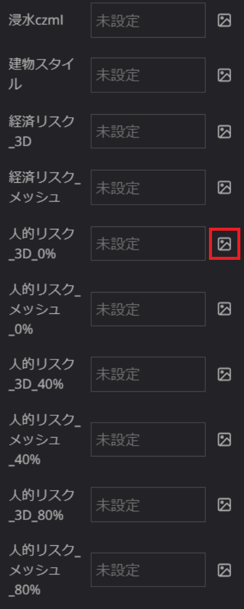
  - ファイルをアップロードをクリックし、ダウンロードしたデータをアセットに登録します。
  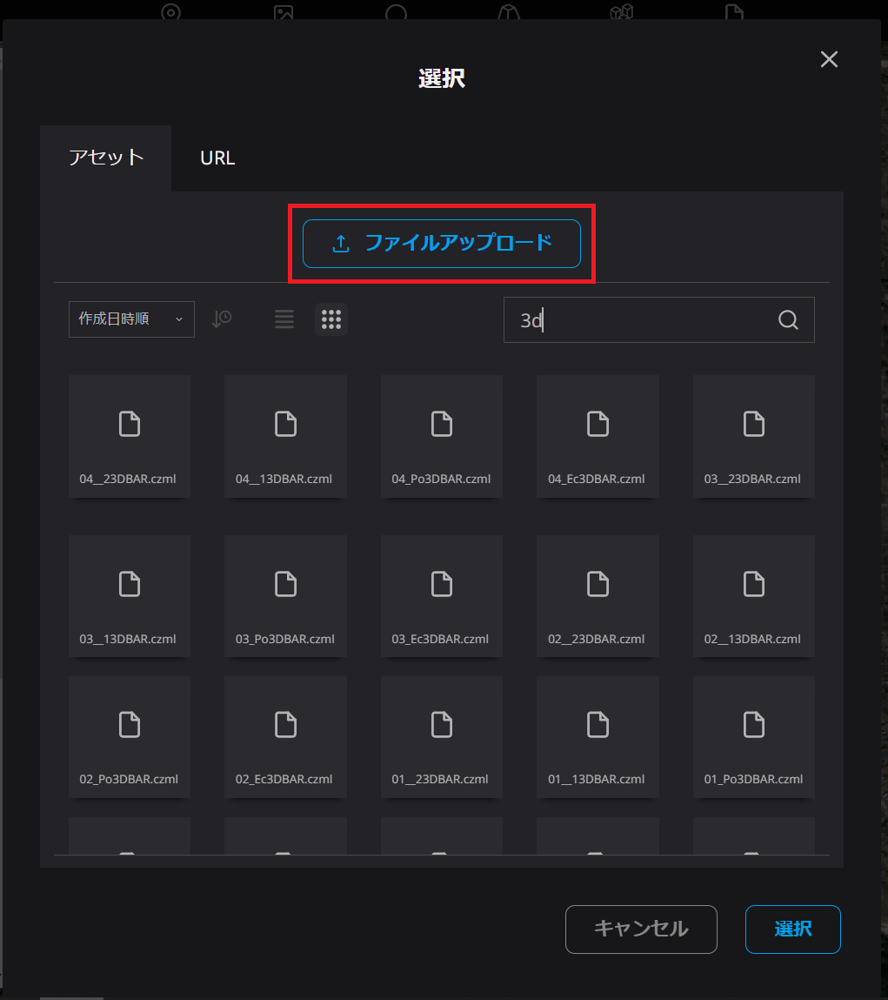
  - アセットに登録されたデータをクリックし、選択をクリックします。
  これでRe:Earthのアセットへのデータの登録と、データの指定が行われます。
  
  
- 各種データ仕様については、[サンプルデータ](/Data_required_for_build)および[技術検証レポート](https://www.mlit.go.jp/plateau/file/libraries/doc/plateau_tech_doc_0011_ver01.pdf)を参照してください。

- 表示データ

  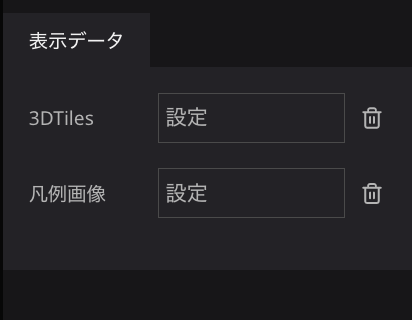
  - 3DTiles：3D都市モデルの3DTiles URLを指定します。 
   (参照URL：https://kiyamademand.com/plateau/LOD2mobaraA221220/tileset.json)
  - 凡例画像：凡例画像を指定します。 
   (参照ファイル：/Data_required_for_build/Legend_image.png)

### 3.3. 使い方

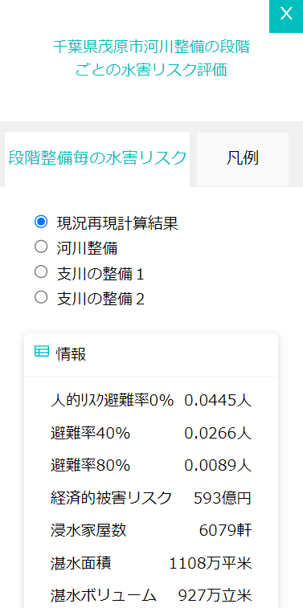

#### 河川事業の段階整備毎【現況再現計算結果/河川整備/支川の整備１/支川の整備２の4区分】の水害リスク情報
- 河川整備段階を選択すると、情報欄に浸水に関する被害情報が表示されます。具体的な情報項目としては、人的被害リスク：避難率0％・40％・80％、経済的被害リスク、浸水家屋数、湛水面積・湛水ボリュームがあります。

#### 水害リスクの可視化メニュー
- 浸水範囲：選択中の河川整備段階における浸水範囲の表示/非表示を切り替えます。
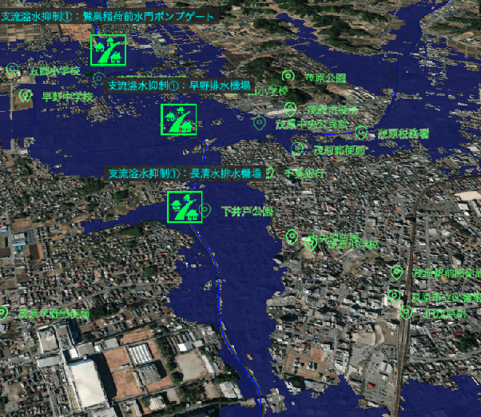
- 建物浸水リスク：選択中の整備段階における最大浸水深に応じた建物単位での浸水リスクが付与された3D都市モデルの表示/非表示を切り替えます。
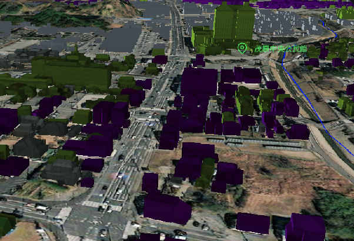
- 各水害リスク表現：選択中の河川整備段階における人的被害リスク（避難率0%・40％・80%）及び経済被害リスクの評価値を用いて、3D棒表示もしくは2Dのメッシュ表示形式のどちらかを選択して可視化する。
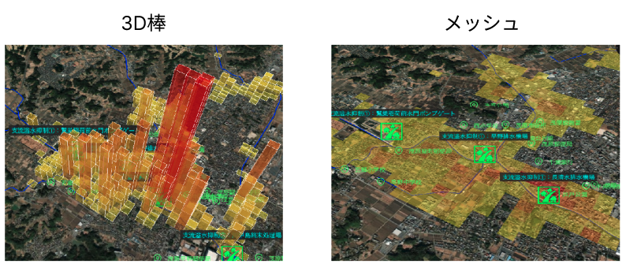
 - 水害リスクのメッシュクリアボタン：現在表示中の水害リスクのデータを全て選択を解消して非表示にします。

### 3.4. プラグインのカスタマイズ
水害リスクの可視化メニューの整備段階名称、各整備段階のリスク情報、可視化メニューの名称(下画像の赤枠部分)を任意の文字列に変更するには、プラグインファイルを編集することで可能です。

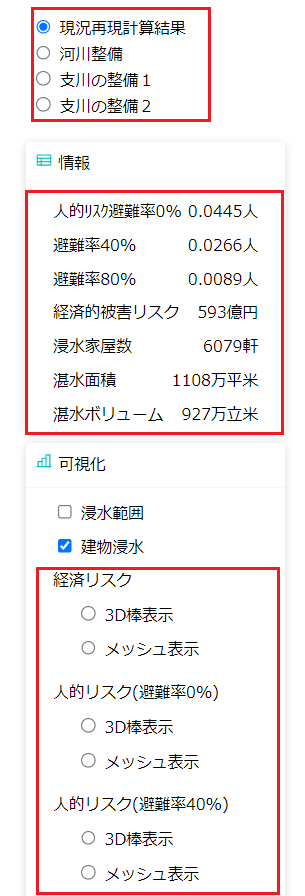

   
「PLATEAU-UC22-034-reearth-plugin-rivermaintenancewidget.zip」を展開し、その中にある「rivermaintenancewidget.js」をテキストエディタで開きます。

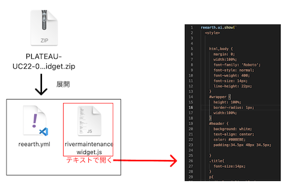

#### 整備段階の名称変更
下図内の各番号の整備段階の名称を変更するには、次の表に示すコード行番号の該当コードの**太字部分**を編集します。（太字部分以外の文字は編集しないでください。）

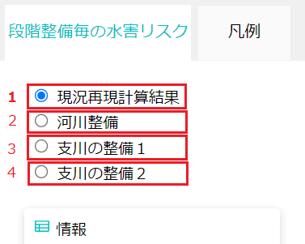

| 変更箇所番号 | コード行番号 | 該当コード                                             | 変更例                                        |
| ------------ | ------------ | ------------------------------------------------------ | --------------------------------------------- |
| 1            | 214行目      | `<label for="stage1">`**現況再現計算結果**`</label>` | `<label for="stage1">`**整備段階①**`</label>` |
| 2            | 218行目      | `<label for="stage2">`**河川整備**`</label>`           | `<label for="stage1">`**整備段階②**`</label>` |
| 3            | 222行目      | `<label for="stage3">`**支川の整備１**`</label>`          | `<label for="stage1">`**整備段階③**`</label>` |
| 4            | 226行目      | `<label for="stage4">`**支川の整備２**`</label>`          | `<label for="stage1">`**整備段階④**`</label>` |

#### 各整備段階のリスク情報の変更
まずはデフォルトで表示される整備段階の情報を修正します。
下図内の変更箇所番号の内容を変更するには、次の表に示すコード行番号の該当コードの**太字部分**を編集します。
（太字部分以外の文字は編集しないでください。）

| 変更箇所番号 | コード行番号 | 該当コード                                                    | 変更例                                             |
| ------------ | ------------ | ------------------------------------------------------------- | -------------------------------------------------- |
| 5            | 244行目      | `
`**人的ﾘｽｸ避難率0%**`
`  | `
`**情報1**`
` |
| 6            | 245行目      | ``**0.0445人**``                    | ``**0.0345人**``         |
| 7            | 248行目      | `
`**避難率40%**`
`        | `
`**情報2**`
` |
| 8            | 249行目      | ``**0.0266人**``                  | ``**0.0345人**``       |
| 9            | 252行目      | `
`**避難率80%**`
`        | `
`**情報3**`
` |
| 10           | 253行目      | ``**0.0089人**``                  | ``**0.0076人**``       |
| 11           | 256行目      | `
`**経済的被害リスク**`
` | `
`**情報4**`
` |
| 12           | 257行目      | ``**593億円**``                     | ``**112億円**``          |
| 13           | 260行目      | `
`**浸水家屋数**`
`       | `
`**情報5**`
` |
| 14           | 261行目      | ``**6079軒**``                        | ``**5030軒**``             |
| 15           | 264行目      | `
`**湛水面積**`
`         | `
`**情報6**`
` |
| 16           | 265行目      | ``**1108万平米**``                     | ``**187万平米**``           |
| 17           | 268行目      | `
`**湛水ボリューム**`
`   | `
`**情報7**`
` |
| 18           | 269行目      | ``**927万立米**``                    | ``**765万立米**``         |

続いて、1~4の各整備段階番号のそれぞれの情報内容を変更するために、次の表に示すコード行番号のコードを編集します。

  
| 整備段階 | コード行番号 |
| -------- | ------------ |
| 1        | 646行目      |
| 2        | 648行目      |
| 3        | 650行目      |
| 4        | 652行目      |

それぞれの整備段階に応じた行の該当コードの**太字部分**を編集します。（太字部分以外の文字は変更しないでください。）

| 変更箇所番号 | 該当コード                     | 変更例                         |
| ------------ | ------------------------------ | ------------------------------ |
| 6            | `'riskPop':'`**0.0445人**`'`   | `'riskPop':'`**0.0445人**`'`   |
| 8            | `'riskPop40':'`**0.0267人**`'` | `'riskPop40':'`**0.0267人**`'` |
| 10           | `'riskPop80':'`**0.0089人**`'` | `'riskPop80':'`**0.0076人**`'` |
| 12           | `'riskEco':'`**593億円**`'`    | `'riskEco':'`**345億円**`'`    |
| 14           | `'house':'`**6,079軒**`'`      | `'house':'`**3,123軒**`'`      |
| 16           | `'area':'`**1,108万平米**`'`   | `'area':'`**876万平米**`'`     |
| 18           | `'volume':'`**927万立米**`'`   | `'volume':'`**123万立米**`'`   |

  

#### 可視化メニューの変更

1. プラグインファイルの編集
下図内の変更箇所番号の表示名を変更するには、次の表に示すコード行番号の該当コードの**太字部分**を編集します。
（太字部分以外の文字は編集しないでください。）

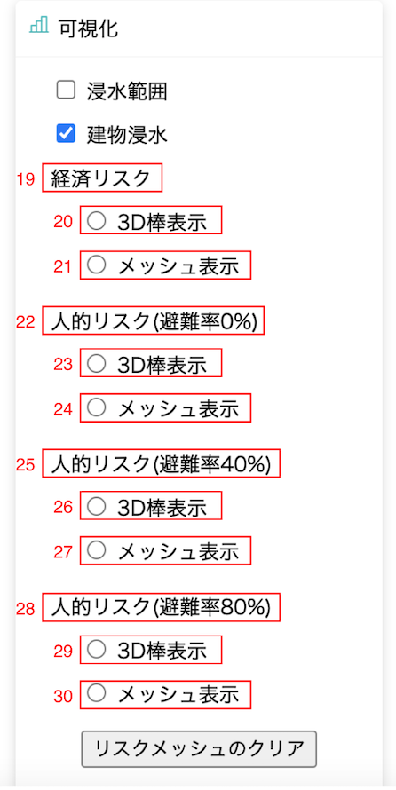

| 変更箇所番号 | コード行番号 | 該当コード                                               | 変更例                                            |
| ------------ | ------------ | -------------------------------------------------------- | ------------------------------------------------- |
| 19           | 306行目      | `<label>`**経済リスク**`</label`                         | `<label>`**リスク1**`</label>`                    |
| 20           | 312行目      | `<label for="riskEco-bar">`**3D棒表示**`</label>`        | `<label for="riskEco-bar">`**表示A**`</label>`    |
| 21           | 318行目      | `<label for="riskEco-mesh">`**メッシュ表示**`</label>`   | `<label for="riskEco-mesh">`**表示B**`</label>`   |
| 22           | 325行目      | `<label>`**人的リスク(避難率0%)**`</label`               | `<label>`**リスク2**`</label>`                    |
| 23           | 331行目      | `<label for="riskPop0-bar">`**3D棒表示**`</label>`       | `<label for="riskPop0-bar">`**表示A**`</label>`   |
| 24           | 337行目      | `<label for="riskPop0-mesh">`**メッシュ表示**`</label>`  | `<label for="riskPop0-mesh">`**表示B**`</label>`  |
| 25           | 344行目      | `<label>`**人的リスク(避難率40%)**`</label`              | `<label>`**リスク3**`</label>`                    |
| 26           | 350行目      | `<label for="riskPop40-bar">`**3D棒表示**`</label>`      | `<label for="riskPop40-bar">`**表示A**`</label>`  |
| 27           | 356行目      | `<label for="riskPop40-mesh">`**メッシュ表示**`</label>` | `<label for="riskPop40-mesh">`**表示B**`</label>` |
| 28           | 363行目      | `<label>`**人的リスク(避難率80%)**`</label`              | `<label>`**リスク4**`</label>`                    |
| 29           | 369行目      | `<label for="riskPop80-bar">`**3D棒表示**`</label>`      | `<label for="riskPop80-bar">`**表示A**`</label>`  |
| 30           | 375行目      | `<label for="riskPop80-mesh">`**メッシュ表示**`</label>` | `<label for="riskPop80-mesh">`**表示B**`</label>` |

2. 定義ファイルの編集
   
続いて、プラグイン設定時にRe:Earth右画面に表示される設定項目名を、プラグインファイルで変更した可視化メニューに対応する名称に変更していきます。

​

PLATEAU-UC22-034-reearth-plugin-rivermaintenancewidget.zip」を展開した際に含まれている「reearth.yml」をテキストエディタで開きます。

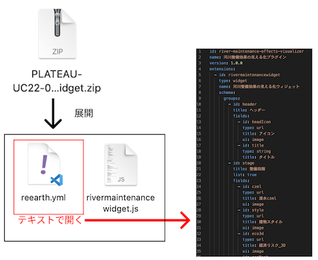​

それぞれの項目名の変更は、コード内の以下のコード行番号の該当コードの**太字部分**を変更します。（太字部分以外の文字は変更しないでください。）

| 変更箇所番号 | コード行番号 | 該当コード                           | 変更例                     |
| ------------ | ------------ | ------------------------------------ | -------------------------- |
| 31           | 34行目       | `title: `**経済リスク_3D**           | `title: `**リスク1_表示A** |
| 32           | 38行目       | `title: `**経済リスク_メッシュ**     | `title: `**リスク1_表示B** |
| 33           | 42行目       | `title: `**人的リスク_3D_0%**        | `title: `**リスク2_表示A** |
| 34           | 46行目       | `title: `**人的リスク_メッシュ_0%**  | `title: `**リスク2_表示B** |
| 35           | 50行目       | `title: `**人的リスク_3D_40%**       | `title: `**リスク3_表示A** |
| 36           | 54行目       | `title: `**人的リスク_メッシュ_40%** | `title: `**リスク3_表示B** |
| 37           | 58行目       | `title: `**人的リスク_3D_80%**       | `title: `**リスク4_表示A** |
| 37           | 62行目       | `title: `**人的リスク_メッシュ_80%** | `title: `**リスク4_表示B** |

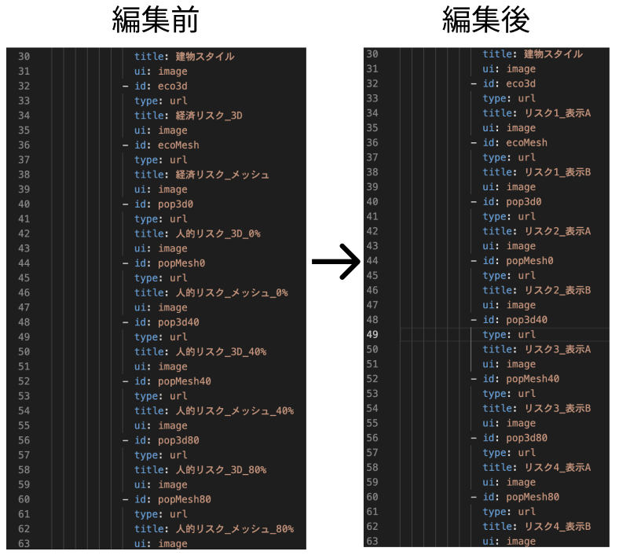​

#### プラグインファイルの再インストール

各ファイルを編集したら保存し、「rivermaintenancewidget.js」、「reearth.yml」の2ファイルをzipファイルに圧縮します。
圧縮したzipファイルをプラグインとしてRe:Earthのプロジェクトにインストールします。

（プラグインのインストールは[3.1. 環境の準備](#31-環境の準備)の「インストール」の項を参照してください。）
各項目名が編集した内容で表示されます。

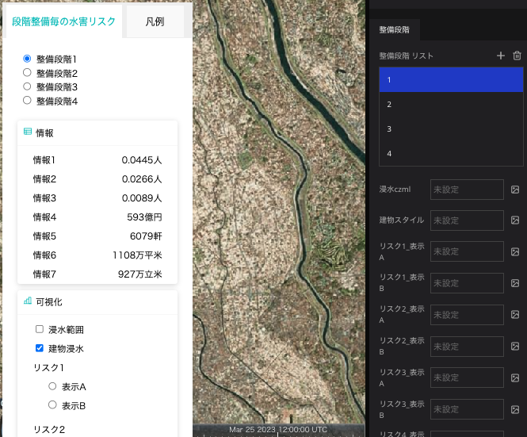​

## ライセンス
* ソースコードおよび関連ドキュメントの著作権は国土交通省に帰属します。
* 本ドキュメントは[Project PLATEAUのサイトポリシー](https://www.mlit.go.jp/plateau/site-policy/)（CCBY4.0および政府標準利用規約2.0）に従い提供されています。

## 注意事項
- 本リポジトリは参考資料として提供しているものです。動作保証は行っておりません。
- 予告なく変更・削除する可能性があります。
- 本リポジトリの利用により生じた損失及び損害等について、国土交通省はいかなる責任も負わないものとします。
- サンプルデータのシミュレーションは、国土交通省都市局が進めるProject PLATEAUの一環として、作成したものであり、千葉県が行う河川 整備の事業効果を示すものではないほか、千葉県が作成する洪水浸水想定区域図とは異なる点にご留意ください。
- サンプルデータのシミュレーションは、令和元年10月25日の大雨に対する総合的内水対策検討業務委託（令和3年3月_茂原市）の解析結果です。これは茂原市が、千葉県が令和4年7月に河川整備計画を改定する以前に概略検討を行った 成果であり、千葉県が行う河川整備の事業効果を示すものではありません。

## 参考資料
- 技術検証レポート「WebGIS技術を用いた水害対策アプリケーションの開発」: https://www.mlit.go.jp/plateau/file/libraries/doc/plateau_tech_doc_0011_ver01.pdf
- PLATEAU Webサイト Use caseページ「河川整備効果の見える化」:https://www.mlit.go.jp/plateau/use-case/uc22-034/
- Re:Earth：[https://reearth.io/](https://reearth.io/)
